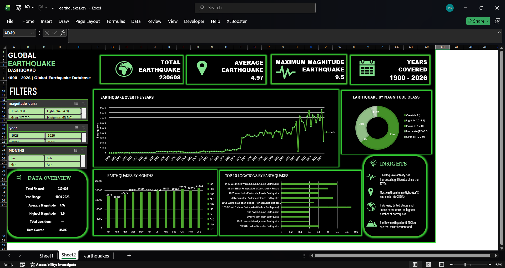

# 🌍 Global Earthquake Dashboard — Excel

An interactive **Global Earthquake Dashboard built in Microsoft Excel**, created to explore and visualize worldwide earthquake data from **1900–2026**.

This was a time-intensive Excel dashboard project focused on data exploration, KPI cards, interactive filters, charts, and extracting useful insights from a large earthquake dataset.

## 📊 Dashboard Preview



## 🎯 Project Objective

The objective of this project was to transform a large earthquake dataset into an interactive and easy-to-understand Excel dashboard.

The dashboard brings together:

- Key performance indicators (KPIs)
- Earthquake trends over time
- Monthly earthquake activity
- Magnitude-class distribution
- Top locations/events shown in the dashboard
- Interactive filters for year, month, and magnitude class
- Summary insights

## 📌 Dashboard KPIs

| KPI | Value shown |
|---|---:|
| Total Earthquakes | 230,608 |
| Average Magnitude | 4.97 |
| Maximum Magnitude | 9.5 |
| Years Covered | 1900–2026 |

## 📈 Dashboard Visualizations

### Earthquake Over the Years
A line chart showing earthquake activity across the years covered by the dataset.

### Earthquakes by Months
A column chart comparing the number of recorded earthquakes across the twelve months.

### Earthquake by Magnitude Class
A doughnut chart showing the distribution of earthquakes across magnitude classes.

### Top 10 Locations by Earthquakes
A horizontal bar chart highlighting the top locations/events displayed by the dashboard analysis.

### Interactive Filters
The dashboard includes filters for:

- Magnitude class
- Year
- Month

## 💡 Dashboard Insights

The dashboard highlights several observations from the available data:

- Earthquake activity increases substantially in the later part of the time series.
- Light and moderate earthquakes represent a large share of the records shown.
- Indonesia, the United States, and Japan are highlighted among locations with high earthquake activity.
- Shallow earthquakes (0–100 km) are highlighted as a frequently occurring depth category.

These observations are based on the dataset and dashboard calculations and should be interpreted in the context of how earthquake records were collected and reported.

## ⚠️ Known Excel Limitations

Some KPI values and filter interactions are **not working perfectly in the final workbook**.

This appears to be related to Excel limitations and the way formulas, dashboard elements, and filtering interact in the workbook.

I have kept this limitation documented rather than presenting the dashboard as fully production-ready.

## 🛠️ Tools & Technologies

- Microsoft Excel
- Excel Charts
- Excel formulas
- Pivot-based analysis
- Slicers / interactive filters
- Data visualization
- Git
- GitHub

## 📂 Repository Contents

```text
Earthquack_Dashboard/
│
├── Dashboard.png
├── Earthquak_Dashboard.xlsx
├── Earthquak_Dataset.csv
└── README.md
```

### Files

**`Earthquak_Dashboard.xlsx`**  
The main Excel dashboard/workbook.

**`Earthquak_Dataset.csv`**  
The earthquake dataset used for the analysis.

**`Dashboard.png`**  
Screenshot/preview of the completed dashboard.

## 📚 Data Source

The dashboard identifies **USGS (United States Geological Survey)** as the data source.

## 🚀 What I Learned

Through this project, I practiced:

- Working with a large real-world dataset
- Data exploration and aggregation
- Building Excel dashboards
- Creating KPI cards
- Designing interactive filters
- Creating charts for data storytelling
- Identifying patterns and insights
- Documenting limitations of an analysis
- Using Git and GitHub to version and publish a data analytics project

## 🔮 Future Improvements

Possible improvements for a future version include:

- Fixing KPI and filter synchronization
- Improving the dashboard's data model
- Adding a world map for earthquake locations
- Adding earthquake depth analysis
- Adding year-over-year comparisons
- Improving interactive filtering
- Rebuilding the dashboard in Power BI for more robust interactivity

## 📌 Project Status

**Completed — Excel Data Analytics & Dashboard Project**

This project is part of my data analytics portfolio and demonstrates practical experience with Excel-based data analysis and visualization.
